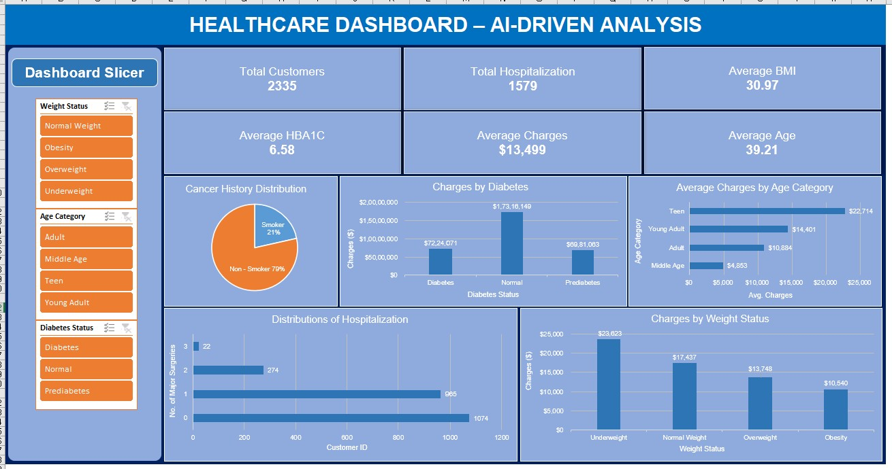

# Healthcare-Data-Analysis

An Excel-based healthcare data analysis project focused on understanding hospital charges, patient health indicators, chronic conditions, and factors associated with higher healthcare costs.

**Project Overview and Objective:**

The source data was provided across three separate tables containing patient, medical, and hospitalization-related information.

The objective was to:

- Combine the separate datasets into a usable master dataset
- Clean and standardize the data
- Handle missing values
- Analyse healthcare charges across different patient and hospital characteristics
- Identify patterns in healthcare costs and patient characteristics
- Build an interactive Excel dashboard for analysis

**Problem Statement:**

The data was fragmented across three separate tables, making it difficult to perform cross-analysis directly. The first step was therefore to clean, integrate and prepare the data into a single master dataset. The analysis then focused on understanding variations in hospital charges and patterns across patient health and hospital-related characteristics.

## Key Attributes

The analysis used attributes from the integrated master dataset, including:

- **Customer ID** – unique identifier used to integrate the source tables
- **Charges** – primary financial metric used for healthcare cost analysis
- **BMI** – used to classify patients by weight status
- **Diabetes Status** – used to compare healthcare charges across diabetes groups
- **Smoker** – used for patient risk segmentation
- **Hospital Tier** – used to compare costs across facility levels
- **City Tier** – used to analyse cost differences by location category

**Tools & Technologies:**

**Microsoft Excel**

- Data Cleaning
- Data Integration
- Pivot Tables
- Excel Charts
- Slicers
- Dashboard Development

**Data Pre-Processing:**

**Data cleaning and preparation:**

- Missing Value: An initial task was performed to check and quantify all missing values (marked with '?') in the source tables.
- Numerical Imputation: Missing values in the 'year' column were imputed using the calculated average of the existing 'year' values, rounded to the nearest integer.
- Categorical Imputation: Missing values in the 'month' column were filled with the categorical value 'Sep'.
- Missing values in 'smoker', 'hospital tier', and 'city tier' were filled using the most frequently occurring value (Mode) for each respective column.
- Data Integration (Manual Merge): The three source files were manually consolidated into a single master dataset using the Customer ID to align records.

**Analysis and Visualizations:**

The analysis was performed using Excel Pivot Tables, charts and summary calculations.
- Core Analysis: Pivot Tables were created to establish key cross-tabulations, such as Charges by Weight Status and Cancer History distribution among smokers vs non-smokers.
- Summary Statistics: Used Excel summary calculations to review overall customer counts, average costs and other key metrics.
- Dashboard Creation: An interactive dashboard was built using the visualizations and incorporating Slicers for dynamic filtering.

**Dashboard Preview:**

The dashboard uses Excel charts and slicers to explore healthcare cost patterns across different patient and hospital characteristics.

**Insights and Conclusion:**

**Key Findings:**

- Healthcare Cost Patterns: Obese patients and patients with Diabetes Status showed higher average hospital charges in the analysed dataset.
- Surgical Cost Pattern: Patients with a higher number of major surgeries showed higher average hospital charges.
- Smoker and Cancer History: Cancer history was approximately 17% among both smokers and non-smokers in the analysed dataset.

**Conclusion:**

The project provided end-to-end experience in data preparation, data integration, analysis and visualization using Excel.
